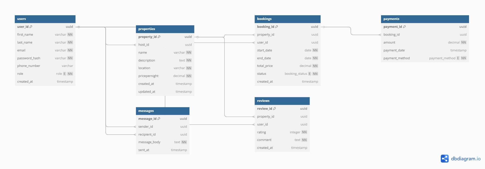

// Use DBML to define your database structure
// Docs: https://dbml.dbdiagram.io/docs

Table users {
  user_id uuid [primary key]
  first_name varchar [not null]
  last_name varchar [not null]
  email varchar [not null, unique]
  password_hash varchar [not null]
  phone_number varchar [null]
  role role [not null]
  created_at timestamp [default: `now()`]

  indexes {
    email
  }
}

enum role {
  guest
  host
  admin
}

Table properties {
  property_id uuid [primary key]
  host_id uuid [ref: > users.user_id]
  name varchar [not null]
  description text [not null]
  location varchar [not null]
  pricepernight decimal [not null]
  created_at timestamp [default: `now()`]
  updated_at timestamp [note: "On Update set `now()"]
}

Table bookings {
  booking_id uuid [primary key]
  property_id uuid [ref: > properties.property_id]
  user_id uuid [ref: > users.user_id]
  start_date date [not null]
  end_date date [not null]
  total_price decimal [not null]
  status booking_status [not null]
  created_at timestamp [default: `now()`]

  indexes {
    property_id
  }
}

enum booking_status {
  pending
  confirmed
  canceled
}

Table payments {
  payment_id uuid [primary key]
  booking_id uuid [ref: > bookings.booking_id]
  amount decimal [not null]
  payment_date timestamp [default: `now()`]
  payment_method payment_method [not null]

  indexes {
    booking_id
  }
}

enum payment_method {
  credit_card
  paypal
  stripe
}

Table reviews {
    review_id uuid [primary key]
    property_id uuid [ref: > properties.property_id]
    user_id uuid [ref: > users.user_id]
    rating integer [not null, note: '1 < value < 5']
    comment text [not null]
    created_at timestamp [default: `now()`]
}

Table messages {
    message_id uuid [primary key]
    sender_id uuid [ref: > users.user_id]
    recipient_id uuid [ref: > users.user_id]
    message_body text [not null]
    sent_at timestamp [default: `now()`]
}

## Visual ER Diagram

Below is the visual representation of the Normalized Airbnb ER Diagram:

